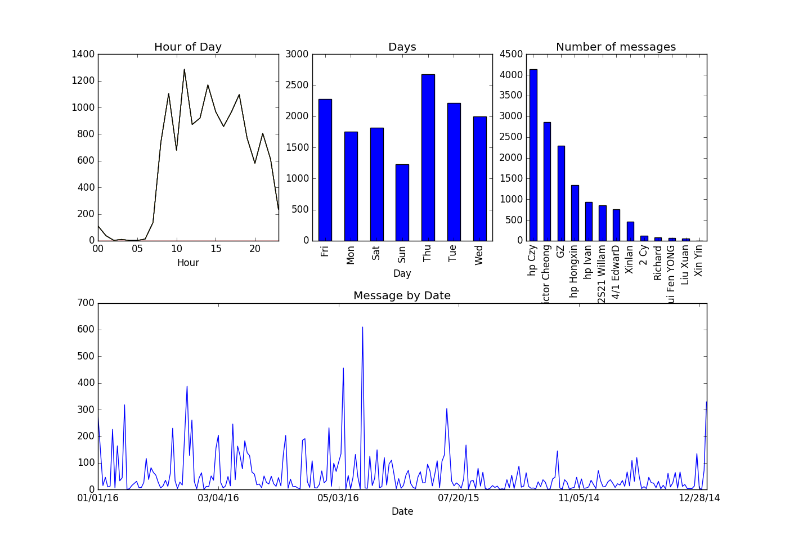

# Whatsapp analytics

### Background / Motivation

Whatsapp is probably    one of the most popular messaging apps around and based on this [article][1], it is approaching the 1 billion users mark. Nearly everyone that I know is using Whatsapp on a daily basis and I believe that there are some useful patterns or behaviours that we can extract from the group chats. 

### What does the script do?
The script will first try to parse the uploaded chat history file (.txt) using [regex][2] and it will group the parsed messages into two dataframes. One for normal messages, the other for actions such as changing chat subject, change group icon, adding users, removing users, ... etc. 

Then it will produce an ugly but simple chart of some statistics derived from the group chat uploaded. 

### How to use script?

TODO

[1]: http://www.wired.com/2016/01/whatsapp-is-nearing-a-billion-users-now-its-time-to-find-the-money/
[2]: https://en.wikipedia.org/wiki/Regular_expression
